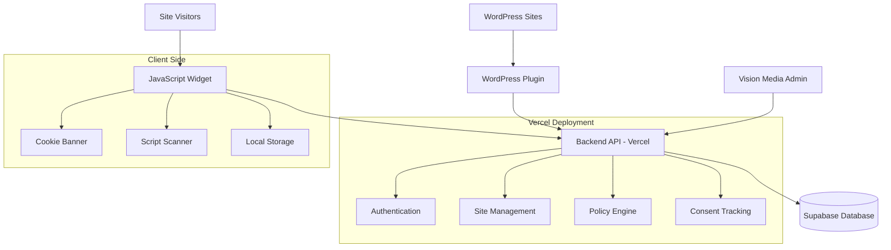
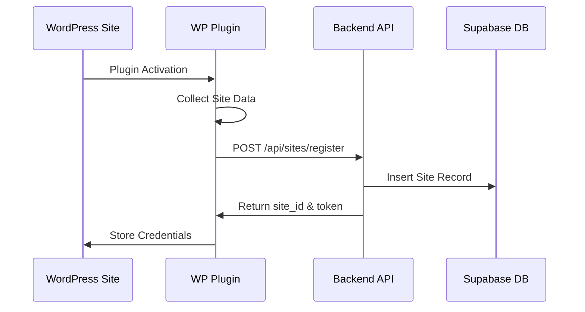
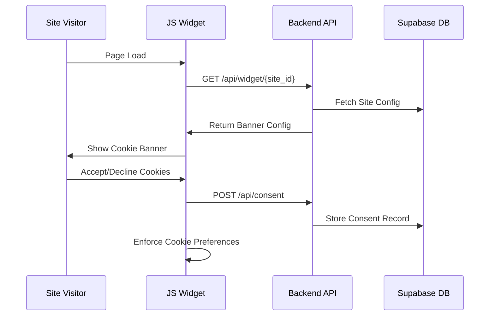
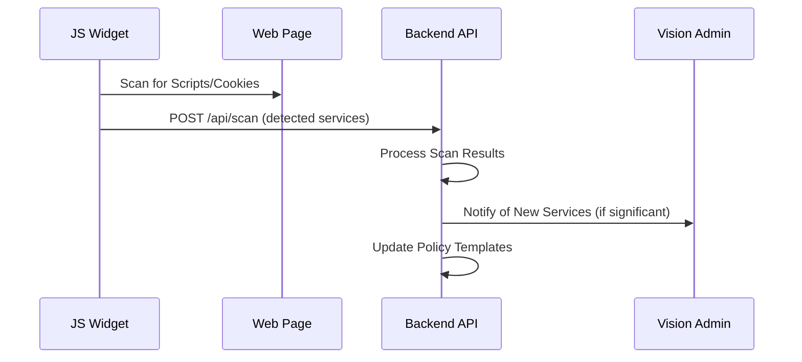

# Vision Privacy - Technical Design Document

## Overview

Vision Privacy is a scalable platform that provides centralized privacy and cookie policy management for 700+ WordPress sites. The system consists of four main components:

1. **Backend API** - Next.js serverless functions on Vercel
2. **Database** - Supabase PostgreSQL with real-time capabilities
3. **JavaScript Widget** - Lightweight client-side consent management
4. **WordPress Plugin** - PHP plugin for site registration and widget injection

The architecture follows a hub-and-spoke model where the central API serves all connected WordPress sites with dynamic privacy policies and cookie banners.

## Architecture



## Components and Interfaces

### 1. Backend API (Next.js on Vercel)

#### Core Endpoints

**Site Registration & Management**
```typescript
// POST /api/sites/register
interface SiteRegistrationRequest {
  domain: string;
  wp_version: string;
  installed_plugins: string[];
  detected_forms: FormData[];
  plugin_version: string;
}

interface SiteRegistrationResponse {
  site_id: string;
  api_token: string;
  widget_url: string;
  success: boolean;
}

// GET /api/sites/{site_id}/config
interface SiteConfigResponse {
  banner_config: BannerConfig;
  privacy_policy: string;
  cookie_categories: CookieCategory[];
  scan_interval: number;
}
```

**Widget & Policy Delivery**
```typescript
// GET /api/widget/{site_id}
interface WidgetConfigResponse {
  banner_html: string;
  banner_css: string;
  cookie_categories: CookieCategory[];
  privacy_policy_url: string;
  consent_endpoint: string;
}

// POST /api/consent
interface ConsentRequest {
  site_id: string;
  visitor_hash: string;
  consent_categories: string[];
  timestamp: string;
  user_agent: string;
}
```

**Client Scanning**
```typescript
// POST /api/scan
interface ClientScanRequest {
  site_id: string;
  detected_scripts: DetectedScript[];
  detected_cookies: DetectedCookie[];
  scan_timestamp: string;
}

interface DetectedScript {
  src: string;
  type: 'analytics' | 'advertising' | 'social' | 'functional' | 'unknown';
  domain: string;
}
```

**Admin Management**
```typescript
// PUT /api/admin/templates
interface TemplateUpdateRequest {
  banner_template: string;
  policy_template: string;
  cookie_categories: CookieCategory[];
  version: string;
}

// GET /api/admin/sites
interface AdminSitesResponse {
  sites: SiteInfo[];
  total_count: number;
  consent_stats: ConsentStats;
}
```

### 2. Database Schema (Supabase PostgreSQL)

```sql
-- Sites table
CREATE TABLE sites (
  id UUID PRIMARY KEY DEFAULT gen_random_uuid(),
  domain VARCHAR(255) UNIQUE NOT NULL,
  api_token VARCHAR(255) UNIQUE NOT NULL,
  wp_version VARCHAR(50),
  plugin_version VARCHAR(50),
  installed_plugins JSONB,
  detected_forms JSONB,
  status VARCHAR(20) DEFAULT 'active',
  created_at TIMESTAMP WITH TIME ZONE DEFAULT NOW(),
  updated_at TIMESTAMP WITH TIME ZONE DEFAULT NOW()
);

-- Consent records
CREATE TABLE consent_records (
  id UUID PRIMARY KEY DEFAULT gen_random_uuid(),
  site_id UUID REFERENCES sites(id) ON DELETE CASCADE,
  visitor_hash VARCHAR(64) NOT NULL, -- SHA-256 of IP + User Agent
  consent_categories JSONB NOT NULL,
  consent_timestamp TIMESTAMP WITH TIME ZONE DEFAULT NOW(),
  expires_at TIMESTAMP WITH TIME ZONE,
  user_agent_hash VARCHAR(64),
  INDEX idx_consent_site_visitor (site_id, visitor_hash),
  INDEX idx_consent_timestamp (consent_timestamp)
);

-- Client scans
CREATE TABLE client_scans (
  id UUID PRIMARY KEY DEFAULT gen_random_uuid(),
  site_id UUID REFERENCES sites(id) ON DELETE CASCADE,
  detected_scripts JSONB NOT NULL,
  detected_cookies JSONB NOT NULL,
  scan_timestamp TIMESTAMP WITH TIME ZONE DEFAULT NOW(),
  processed BOOLEAN DEFAULT FALSE,
  INDEX idx_scans_site_time (site_id, scan_timestamp)
);

-- Global templates
CREATE TABLE policy_templates (
  id UUID PRIMARY KEY DEFAULT gen_random_uuid(),
  template_type VARCHAR(50) NOT NULL, -- 'banner', 'policy'
  content TEXT NOT NULL,
  version VARCHAR(20) NOT NULL,
  is_active BOOLEAN DEFAULT FALSE,
  created_by VARCHAR(255),
  created_at TIMESTAMP WITH TIME ZONE DEFAULT NOW()
);

-- Cookie categories
CREATE TABLE cookie_categories (
  id UUID PRIMARY KEY DEFAULT gen_random_uuid(),
  name VARCHAR(100) NOT NULL,
  description TEXT,
  is_essential BOOLEAN DEFAULT FALSE,
  sort_order INTEGER DEFAULT 0,
  is_active BOOLEAN DEFAULT TRUE
);

-- Site-specific policy overrides
CREATE TABLE site_policies (
  id UUID PRIMARY KEY DEFAULT gen_random_uuid(),
  site_id UUID REFERENCES sites(id) ON DELETE CASCADE,
  policy_content TEXT,
  banner_config JSONB,
  last_updated TIMESTAMP WITH TIME ZONE DEFAULT NOW(),
  template_version VARCHAR(20)
);
```

### 3. JavaScript Widget

#### Widget Structure
```typescript
interface VisionPrivacyWidget {
  // Core initialization
  init(siteId: string, config: WidgetConfig): void;
  
  // Banner management
  showBanner(): void;
  hideBanner(): void;
  updateBannerContent(content: string): void;
  
  // Consent management
  getConsent(): ConsentData | null;
  setConsent(categories: string[]): Promise<boolean>;
  hasValidConsent(): boolean;
  
  // Script scanning
  scanPage(): DetectedScript[];
  reportScan(scanData: ClientScanRequest): Promise<void>;
  
  // Cookie management
  blockScripts(categories: string[]): void;
  allowScripts(categories: string[]): void;
}
```

#### Widget Implementation Approach
```javascript
// Widget loads asynchronously and self-initializes
(function() {
  'use strict';
  
  class VisionPrivacyWidget {
    constructor(siteId, apiEndpoint) {
      this.siteId = siteId;
      this.apiEndpoint = apiEndpoint;
      this.consent = this.loadStoredConsent();
      this.config = null;
      this.bannerElement = null;
    }
    
    async init() {
      // Fetch configuration from API
      this.config = await this.fetchConfig();
      
      // Check existing consent
      if (!this.hasValidConsent()) {
        await this.showBanner();
      } else {
        this.enforceConsent();
      }
      
      // Schedule periodic scanning
      this.scheduleScanning();
    }
    
    // Implementation details for each method...
  }
  
  // Auto-initialize when script loads
  window.VisionPrivacy = new VisionPrivacyWidget(
    window.VP_SITE_ID, 
    window.VP_API_ENDPOINT
  );
  window.VisionPrivacy.init();
})();
```

### 4. WordPress Plugin

#### Plugin Structure
```php
<?php
/**
 * Plugin Name: Vision Privacy
 * Description: Centralized privacy and cookie policy management
 * Version: 1.0.0
 */

class VisionPrivacyPlugin {
    private $api_endpoint = 'https://your-api.vercel.app';
    private $site_token;
    
    public function __construct() {
        add_action('init', [$this, 'init']);
        add_action('wp_head', [$this, 'inject_widget']);
        register_activation_hook(__FILE__, [$this, 'activate']);
        register_deactivation_hook(__FILE__, [$this, 'deactivate']);
    }
    
    public function activate() {
        $this->register_site();
    }
    
    public function register_site() {
        $site_data = [
            'domain' => get_site_url(),
            'wp_version' => get_bloginfo('version'),
            'installed_plugins' => $this->get_installed_plugins(),
            'detected_forms' => $this->detect_forms(),
            'plugin_version' => '1.0.0'
        ];
        
        $response = wp_remote_post($this->api_endpoint . '/api/sites/register', [
            'body' => json_encode($site_data),
            'headers' => ['Content-Type' => 'application/json']
        ]);
        
        if (!is_wp_error($response)) {
            $data = json_decode(wp_remote_retrieve_body($response), true);
            if ($data['success']) {
                update_option('vision_privacy_site_id', $data['site_id']);
                update_option('vision_privacy_token', $data['api_token']);
                update_option('vision_privacy_widget_url', $data['widget_url']);
            }
        }
    }
    
    public function inject_widget() {
        $site_id = get_option('vision_privacy_site_id');
        $widget_url = get_option('vision_privacy_widget_url');
        
        if ($site_id && $widget_url) {
            echo "<script>
                window.VP_SITE_ID = '{$site_id}';
                window.VP_API_ENDPOINT = '{$this->api_endpoint}';
            </script>";
            echo "<script src='{$widget_url}' async></script>";
        }
    }
    
    private function get_installed_plugins() {
        if (!function_exists('get_plugins')) {
            require_once ABSPATH . 'wp-admin/includes/plugin.php';
        }
        return array_keys(get_plugins());
    }
    
    private function detect_forms() {
        // Scan for common form plugins and contact forms
        $forms = [];
        
        // Contact Form 7
        if (is_plugin_active('contact-form-7/wp-contact-form-7.php')) {
            $forms[] = ['type' => 'contact-form-7', 'count' => wp_count_posts('wpcf7_contact_form')->publish];
        }
        
        // Gravity Forms
        if (class_exists('GFForms')) {
            $forms[] = ['type' => 'gravity-forms', 'count' => count(\GFAPI::get_forms())];
        }
        
        return $forms;
    }
}

new VisionPrivacyPlugin();
```

## Data Flow

### 1. Site Registration Flow


### 2. Widget Loading & Consent Flow


### 3. Client Scanning Flow


## Error Handling

### API Error Responses
```typescript
interface APIError {
  error: string;
  message: string;
  code: number;
  details?: any;
}

// Common error codes
enum ErrorCodes {
  INVALID_SITE_ID = 1001,
  INVALID_TOKEN = 1002,
  RATE_LIMIT_EXCEEDED = 1003,
  CONSENT_EXPIRED = 1004,
  SCAN_PROCESSING_ERROR = 1005
}
```

### Widget Error Handling
- Graceful degradation when API is unavailable
- Local storage fallback for consent data
- Retry mechanisms with exponential backoff
- Silent failure modes to avoid breaking host sites

### WordPress Plugin Error Handling
- Registration retry on activation failure
- Fallback widget injection if API is down
- Admin notices for configuration issues
- Automatic re-registration on domain changes

## Testing Strategy

### Unit Testing
- **API Functions**: Test all endpoint logic with mocked database
- **Widget Methods**: Test consent management and script detection
- **Plugin Functions**: Test WordPress integration and data collection

### Integration Testing
- **API-Database**: Test all database operations and queries
- **Widget-API**: Test complete consent and scanning workflows
- **Plugin-API**: Test site registration and configuration sync

### End-to-End Testing
- **Complete User Journey**: From plugin installation to consent collection
- **Multi-site Scenarios**: Test with multiple WordPress installations
- **Performance Testing**: Load testing with 700+ concurrent sites

### Security Testing
- **Input Validation**: Test all API endpoints for injection attacks
- **Authentication**: Test token-based security
- **Data Privacy**: Verify IP hashing and data encryption
- **CORS Configuration**: Test cross-origin requests from WordPress sites

## Security Considerations

### Data Protection
- **IP Address Hashing**: SHA-256 hash of IP + User Agent before storage
- **Token-based Authentication**: Unique API tokens per site
- **HTTPS Enforcement**: All API communications over TLS
- **Input Sanitization**: Validate and sanitize all user inputs

### Privacy Compliance
- **Consent Expiration**: Automatic consent expiry after 12 months
- **Data Export**: API endpoints for GDPR data export requests
- **Data Deletion**: Cascade deletes when sites are removed
- **Audit Logging**: Track all consent changes and policy updates

### Performance & Scalability
- **CDN Integration**: Serve widget from Vercel Edge Network
- **Database Indexing**: Optimized queries for consent lookups
- **Caching Strategy**: Cache policy templates and site configurations
- **Rate Limiting**: Prevent API abuse with request throttling

### Monitoring & Observability
- **Error Tracking**: Comprehensive error logging and alerting
- **Performance Metrics**: API response times and database query performance
- **Usage Analytics**: Track consent rates and widget performance
- **Health Checks**: Automated monitoring of all system components